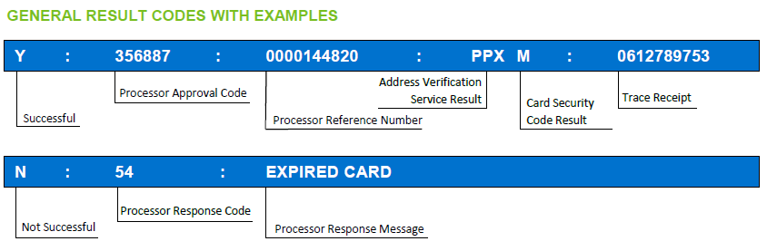

### 

### &nbsp;

### Address Verification Service (AVS) Results

The AVS response logic is the following:

  * the&nbsp;1st letter of the AVS code relates to the street address
  * the 2nd letter of the AVS code relates to the postcode/zip

whereas the letters indicate:

<table>
  <tbody>
    <tr>
      <td>
        <strong>Value</strong>
      </td>
      
      <td>
        &nbsp;&nbsp;
      </td>
      
      <td>
        <strong>Meaning</strong>
      </td>
    </tr>
    
    <tr>
      <td>
        Y
      </td>
      
      <td>
        &nbsp;
      </td>
      
      <td>
        The submitted value matches with the card issuer's records
      </td>
    </tr>
    
    <tr>
      <td>
        N
      </td>
      
      <td>
        &nbsp;
      </td>
      
      <td>
        The submitted value does not match with the card issuer's records
      </td>
    </tr>
    
    <tr>
      <td>
        P
      </td>
      
      <td>
        &nbsp;
      </td>
      
      <td>
        No value has been provided or the provided value has not been checked by the card issuer
      </td>
    </tr>
  </tbody>
</table>

### &nbsp;

### Card Security Code Verification Results

<table>
  <tbody>
    <tr>
      <td>
        <strong>Value</strong>
      </td>
      
      <td>
        &nbsp;&nbsp;
      </td>
      
      <td>
        <strong>Meaning</strong>
      </td>
    </tr>
    
    <tr>
      <td>
        M
      </td>
      
      <td>
        &nbsp;
      </td>
      
      <td>
        Card Security Code matches
      </td>
    </tr>
    
    <tr>
      <td>
        N
      </td>
      
      <td>
        &nbsp;
      </td>
      
      <td>
        Card Security Code does not match
      </td>
    </tr>
    
    <tr>
      <td>
        P
      </td>
      
      <td>
        &nbsp;
      </td>
      
      <td>
        Not processed
      </td>
    </tr>
    
    <tr>
      <td>
        S
      </td>
      
      <td>
        &nbsp;
      </td>
      
      <td>
        Merchant has indicated that the card security code is not present on the card
      </td>
    </tr>
    
    <tr>
      <td>
        U
      </td>
      
      <td>
        &nbsp;
      </td>
      
      <td>
        Issuer is not certified and/or has not provided encryption keys
      </td>
    </tr>
    
    <tr>
      <td>
        X
      </td>
      
      <td>
        &nbsp;
      </td>
      
      <td>
        No response from the credit card association was received.
      </td>
    </tr>
    
    <tr>
      <td>
        &nbsp;
      </td>
      
      <td>
        &nbsp;
      </td>
      
      <td>
        A blank response indicates that no code was sent and that there was no indication that the code was not present on the card.
      </td>
    </tr>
  </tbody>
</table>

### &nbsp;

### Most Common Card Processing Response Codes

<table>
  <tbody>
    <tr>
      <td>
        

          <strong>Authorization Response Code</strong>
        

      </td>
      
      <td>
        

          &nbsp;
        

        
        

          <strong>Response Code Description</strong>
        

      </td>
      
      <td>
        

          &nbsp;
        

        
        

          <strong>Gateway Approval Code Example</strong>
        

      </td>
    </tr>
    
    <tr>
      <td>
        

          00
        

      </td>
      
      <td>
        

          Transaction has been approved.
        

      </td>
      
      <td>
        

          Y:000000:3989951798:PPX:259280509
        

      </td>
    </tr>
    
    <tr>
      <td>
        

          05
        

      </td>
      
      <td>
        

          The card being used for the transaction has been rejected by the issuer.
        

      </td>
      
      <td>
        

          N:05:Do Not Honour
        

      </td>
    </tr>
    
    <tr>
      <td>
        

          -5993
        

      </td>
      
      <td>
        

          The transaction has been cancelled by the consumer. 
        

      </td>
      
      <td>
        

          N:-5993:Cancelled by user
        

      </td>
    </tr>
  </tbody>
</table>

### &nbsp;

### Response Codes Related to Configuration Issues

<table>
  <tbody>
    <tr>
      <td>
        

          <strong>Authorization Response Code</strong>
        

      </td>
      
      <td>
        

          <strong>Response Code Description</strong>
        

      </td>
      
      <td>
        

          <strong>Gateway Approval Code</strong>
        

      </td>
    </tr>
    
    <tr>
      <td>
        

          -5002
        

      </td>
      
      <td>
        

          The merchant does not have a service entry for the card brand that has been used in the transaction request.
        

      </td>
      
      <td>
        

          N:-5002:brand not supported
        

      </td>
    </tr>
    
    <tr>
      <td>
        -12000
      </td>
      
      <td>
        The merchant has the service entry Card Code Mandatory, but sent a MOTO/ECI transaction without card code value. 
      </td>
      
      <td>
        N:-12000:Card security code is mandatory
      </td>
    </tr>
    
    <tr>
      <td>
        

          -30053
        

      </td>
      
      <td>
        

          The transaction timed out.
        

      </td>
      
      <td>
        

          &nbsp;
        

        
        

          N:-30053:Communication Error
        

        
        

          &nbsp;
        

      </td>
    </tr>
    
    <tr>
      <td>
        

          -30053
        

      </td>
      
      <td>
        

          Exception occurred retrieving the message from the endpoint.
        

      </td>
      
      <td>
        

          N:-30053:Communication Error
        

      </td>
    </tr>
    
    <tr>
      <td>
        

          -30060
        

      </td>
      
      <td>
        

          An error occured building, parsing or interpreting the message.
        

      </td>
      
      <td>
        

          N:30060:Internal Error
        

      </td>
    </tr>
    
    <tr>
      <td>
        

          -50653
        

      </td>
      
      <td>
        

          Incorrect currency has been sent in the request.
        

      </td>
      
      <td>
        

          N:-50653:Sent invalid currency or no currencies were setup for this store
        

      </td>
    </tr>
  </tbody>
</table>

&nbsp;

### Response Codes Related to First Data Local Payments

<table>
  <tbody>
    <tr>
      <td>
        

          <strong>Authorization Response Code</strong>
        

      </td>
      
      <td>
        

          <strong>Response Code Description</strong>
        

      </td>
      
      <td>
        

          <strong>Gateway Approval Code</strong>
        

      </td>
    </tr>
    
    <tr>
      <td>
        

          -PP00001
        

      </td>
      
      <td>
        

          Cardholder did not return from local payment redirection.
        

      </td>
      
      <td>
        

          N:-PP00001:Cardholder did not return from alternate payment
        

      </td>
    </tr>
    
    <tr>
      <td>
        

          INPUT_DATA
        

      </td>
      
      <td>
        

          Transaction input data are incorrect, channel tag or transaction has not been found.
        

      </td>
      
      <td>
        

          N:INPUT_DATA:Invalid input data
        

      </td>
    </tr>
    
    <tr>
      <td>
        

          QUOTA
        

      </td>
      
      <td>
        

          Refund quota exceeded - not enough funds available.
        

      </td>
      
      <td>
        

          N:QUOTA:APM
        

      </td>
    </tr>
  </tbody>
</table>

&nbsp;

### &nbsp;

&nbsp;

### &nbsp;
